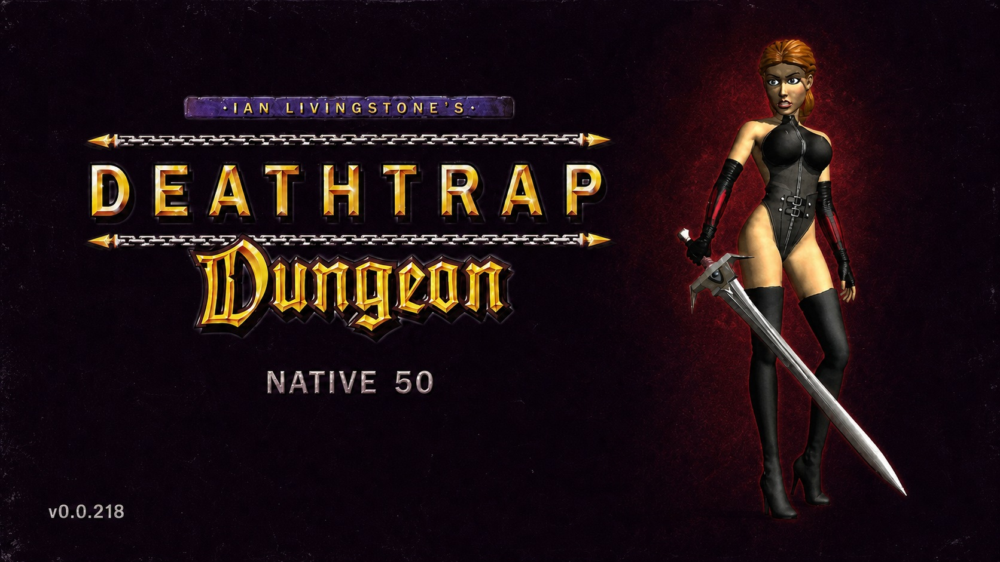

# Deathtrap Native 50

Current development version: **0.0.218**

<p align="center">
  <a href="https://youtu.be/U1RjdVP49TQ"></a>
  <a href="https://ko-fi.com/utkiduck"></a>
</p>

<p align="center">
  
</p>

Deathtrap Native 50 is a free, unofficial modernization patch for the original
32-bit Windows release of *Ian Livingstone's Deathtrap Dungeon* (1998). It
raises the unique rendered output from roughly 16.7 FPS to approximately 50
FPS without speeding up simulation, and adds modern camera, input, controller,
first-person and audio improvements.

The patch was developed using OpenAI Codex under human direction and was
validated through extensive manual playtesting and automated tests.

Verified and tested with the
[Steam release of Deathtrap Dungeon](https://store.steampowered.com/app/245010/Deathtrap_Dungeon/).

This project is not affiliated with or endorsed by Square Enix, Eidos
Interactive, Asylum Studios, Ian Livingstone or the developers of dgVoodoo.
It contains no game assets, game executables, soundtrack files or dgVoodoo
binaries.

## Highlights

- Approximately 50 FPS native presentation while preserving the original game
  speed, AI, combat, collision, animation and audio clocks.
- Freely controlled modern third-person orbit camera for mouse and right stick,
  with collision handling and support for the game's authored camera shots.
- Camera-relative Xbox-compatible controller movement with faster, more
  responsive turning while retaining the original animation and collision.
- Full controller support in gameplay, menus, loading screens and movies,
  including menu navigation and a right-stick pointer.
- Radial inventory selector with the game's own icons for melee, ranged,
  spell/shield and potion/charm categories.
- Event-driven controller vibration for attacks, hits, blocking, parries,
  spells, ranged shots, healing, landing, damage, death and radial selection.
- Original Tab/R3 first-person camera plus a separate body-visible immersive
  first-person view on F10/View/Back.
- Full-speed lateral and diagonal movement in immersive first person on both
  keyboard and controller.
- Physical-mouse camera control, mouse attack/parry and mouse-wheel melee
  weapon selection.
- Correct routing for all fifteen music tracks shipped with the Steam release.
- Longer gameplay prompts and safe per-launch diagnostic logs when explicitly
  enabled.

See the [user-facing changelog](CHANGELOG.md) for the complete consolidated
list of changes from the original Steam release.

## Support development

Deathtrap Native 50 is completely free, and no features or downloads are
locked behind donations. If you enjoy the patch and voluntarily want to help
support continued fixes, development-tool and AI-subscription costs, or future
game-modernization projects, you can donate through
[Ko-fi](https://ko-fi.com/utkiduck).

## Compatibility

The current release supports:

- the [Steam release, App ID `245010`](https://store.steampowered.com/app/245010/Deathtrap_Dungeon/);
- Windows 10 or 11 x64;
- the original 32-bit game process;
- the tested game binaries below, or another build with a compatible internal
  layout;
- [dgVoodoo2](https://github.com/dege-diosg/dgVoodoo2/releases) 2.86 or newer
  using its x86 DirectDraw/D3DImm D3D11 wrappers.

| File | Tested Steam SHA-256 |
|---|---|
| `Dungeon.dll` | `95FE9CE0FFF387F00704548F152E4340815213FCB3833DBE1B5C42871E7D2E56` |
| `DD_CD.EXE` | `0C644A00E62652E046C5DAD2960F0F6C8C1998F4CA065780FBD7811D9908BF1F` |

These hashes are compatibility fingerprints, not an installation lock. The
installer warns when either file differs and continues. Other store releases,
fan patches and modified executables have not been verified and may work
partially, fail to activate, crash or corrupt game state. The DLL retains a
structural safety check before applying fixed-address hooks.

[dgVoodoo2](https://github.com/dege-diosg/dgVoodoo2) is an independent external
dependency. Its binaries are not redistributed here; the release contains only
an optional tested user configuration. Configure dgVoodoo2 for
`D3D11 feature level 11.0` (`OutputAPI = d3d11_fl11_0`). The game uses the x86
`DDraw.dll` and `D3DImm.dll` wrappers; `D3D9.dll` is optional and is not
required by the verified DirectDraw path.

## Download and verification

Published builds are distributed as versioned ZIP files through GitHub
Releases. Each release also includes a SHA-256 file for the complete archive,
and the archive contains `SHA256SUMS.txt` for its individual files.

The ZIP can be extracted directly into the game directory. Runtime files are
kept in `payload` so extracting an update cannot overwrite the installed patch
before `INSTALL.cmd` creates its rollback copy:

```text
INSTALL.cmd
install.ps1
README.txt
CHANGELOG.txt
SHA256SUMS.txt
THIRD_PARTY_NOTICES.txt
LICENSE.txt
payload/
  DINPUT.dll
  deathtrap_native.ini
optional/
  dgVoodoo.conf              tested high-quality preset; applied manually
  dgVoodoo-General.png       visual reference for the General tab
  dgVoodoo-DirectX.png       visual reference for the DirectX tab
```

`THIRD_PARTY_NOTICES.txt` is required by the licences of code statically linked
into `DINPUT.dll`; it is part of the minimal distributable package. Copying only
`payload/DINPUT.dll` is not a complete installation because the patch also
requires its configuration and additional native bindings in
`ASYLUM/keys.cfg`.

## Installation

**dgVoodoo2 is a mandatory runtime dependency for the supported patch. Install
and configure it before copying Deathtrap Native 50.** `DINPUT.dll` may load
without dgVoodoo2 and some input hooks may initialize, but the complete patch
is not expected to render correctly: the higher-rate renderer, hidden
page-restore presentation and black-frame guard require dgVoodoo's D3D11/DXGI
swapchain.

1. Close the game.
2. Download dgVoodoo2 2.86 or newer from the
   [official releases page](https://github.com/dege-diosg/dgVoodoo2/releases).
3. From the dgVoodoo2 package, copy `dgVoodooCpl.exe` and the **x86**
   `DDraw.dll` and `D3DImm.dll` wrappers into the directory containing
   `DD_CD.EXE`. Do not use the x64 wrappers. `D3D9.dll` is not required by
   Deathtrap Dungeon.
4. Run `dgVoodooCpl.exe`, select/add the Deathtrap Dungeon directory, set
   **Output API** to **Direct3D 11 feature level 11.0**, and apply the changes.
   Confirm that `dgVoodoo.conf` was created beside `DD_CD.EXE` and contains:

   ```ini
   [General]
   OutputAPI = d3d11_fl11_0
   ```

5. Extract every file from the Deathtrap Native 50 release ZIP directly beside
   `DD_CD.EXE`, preserving the included `payload` directory.
6. For the tested high-quality graphics profile, first back up the active
   `dgVoodoo.conf`, then copy `optional\dgVoodoo.conf` from the extracted
   patch over the active file beside `DD_CD.EXE`. This step is recommended but
   manual: the installer never modifies dgVoodoo configuration.
7. Double-click `INSTALL.cmd` once. It validates the required dgVoodoo2 setup,
   checks the game version, backs up any previous patch installation, installs
   the payload, applies the verified control profile and normalizes the
   required game rendering settings.
8. Start Deathtrap Dungeon normally.

The optional tested preset uses `3x` internal DirectX resolution, `8x` MSAA,
`16x` anisotropic filtering, automatic mipmaps and forced VSync. These values
make a large visual difference compared with unscaled dgVoodoo defaults. If
performance is insufficient, use `2x` resolution and `4x` MSAA instead; keep
the D3D11 FL11 output API unchanged.

**General tab**


**DirectX tab**


`<SteamLibrary>` is a placeholder for any Steam library. The installer:

- identifies the Steam installation and warns if its game hashes differ from
  the tested build without blocking installation;
- verifies the external dgVoodoo files and required D3D11 setting;
- backs up the installed DLL, patch configuration, `ASYLUM/keys.cfg` and
  `ASYLUM/config.dat` before changing them;
- applies the verified keyboard profile while preserving mouse, joystick and
  unrelated retail bindings;
- normalizes the required game rendering values, including hardware D3D,
  mipmapping and subtractive shadows;
- reads but never modifies `dgVoodoo.conf`.

Advanced users can run `install.ps1 -WhatIf` to validate the installation
without modifying the control file.
Detailed requirements, first-run verification and rollback instructions are in
[Running and installation](docs/RUNNING.md).

## Controls

### Mouse and keyboard

| Input | Action |
|---|---|
| Mouse movement | Rotate the modern camera; look around in first person |
| Left mouse button | Primary attack |
| Right mouse button | Block/parry |
| Mouse wheel | Previous/next available melee weapon |
| `W` / `S` | Walk forward/backward |
| `Shift` + `W` / `S` | Run forward/backward |
| `A` / `D` | Turn left/right in normal gameplay |
| `Shift` + `A` / `D` | Fast turn left/right |
| `J` / `K` | Side-step left/right |
| `Ctrl` + `W` / `S` | Step forward/backward |
| `Ctrl` + `A` / `D` | Original side-step left/right |
| `Space` | Jump or climb |
| `Space` + direction | Directional jump |
| `F` | Ranged attack / original combat modifier |
| `F` + `W` / `A` / `D` | Original directional melee attacks |
| `F` + `S` | Original parry |
| `Q` | Cast/use the selected spell |
| `E` | Operate or interact |
| `F1` / `F2` / `F3` / `F4` | Melee / ranged / spell-shield / consumable selector |
| `1`-`8` | Choose a slot in an opened retail item selector |
| `Tab` | Toggle the original retail first-person view |
| `F10` | Toggle body-visible immersive first person |
| `F11` | Toggle the higher native render rate |
| `I` | Inventory screen |
| `Esc` | Open or leave the menu |
| `O` / `P` | Save/load game |

In immersive first person, `A` and `D` become full-speed pure side movement;
`W`/`S` can be combined with them for diagonal movement, and `Shift` selects
the running speed.

### Xbox-compatible controller

| Input | Gameplay | Menus and selectors |
|---|---|---|
| Left stick | Camera-relative movement; full tilt runs | Navigate |
| Right stick | Rotate the camera / first-person look | Move pointer or select radial slot |
| `A` | Jump or climb | Confirm; skip supported movies/screens |
| `B` | — | Back |
| `X` | Operate/interact | Alternate skip on supported screens |
| `Y` | Unassigned | Unassigned |
| `RT` | Primary attack | — |
| `LT` | Block/parry | — |
| `RB` | Cast/use contextual spell action | — |
| Hold `LB` + left stick | Original side-step movement | — |
| `Start/Menu` | Open pause menu | Back/leave menu |
| `R3` | Toggle original retail first-person view | — |
| `View/Back` | Toggle body-visible immersive first person | — |
| Tap D-pad | Cycle the next item in that category | Navigate |
| Hold D-pad | Open radial selector | Keep held and choose with right stick |

D-pad categories are up for melee weapons, right for ranged items, down for
spells/shields, and left for potions/charms. Camera input is suppressed while
the radial selector owns the right stick.

All bindings and sensitivity values can be adjusted in
`deathtrap_native.ini`.

## Building

Requirements:

- Visual Studio 2022 C++ Build Tools;
- Windows SDK;
- CMake 3.21 or newer;
- PowerShell 5.1 or newer.

Build and run the complete deterministic verification suite:

```powershell
.\scripts\build-x86.ps1
```

Create the same release package used by GitHub Actions:

```powershell
.\scripts\package-release.ps1 -OutputDirectory artifacts
```

The build must be Win32. A 64-bit DLL cannot be loaded by `DD_CD.EXE`. MinHook
1.3.4 is downloaded during the first CMake configure and linked statically; no
separate MinHook runtime DLL is needed. See [Building](docs/BUILDING.md) and
[third-party notices](THIRD_PARTY_NOTICES.md).

## Release process

`VERSION` is the single source of truth for CMake, DLL metadata, package names
and Git tags. Pushing a matching tag such as `v0.0.218` runs the Windows build,
all deterministic tests, creates a versioned ZIP and checksum, and opens a
draft GitHub Release for final human review.

See [Publishing releases](docs/RELEASING.md) for the exact procedure.

## Projects and repositories used

- [MinHook](https://github.com/TsudaKageyu/minhook) 1.3.4 — the only external
  repository whose code is compiled into `DINPUT.dll`; linked statically under
  its BSD-2-Clause licence.
- [dgVoodoo2](https://github.com/dege-diosg/dgVoodoo2) — required external x86
  DirectDraw/D3DImm-to-D3D11 runtime; its binaries are downloaded separately.
  This project includes only an optional tested `dgVoodoo.conf`.
- [Unity Cinemachine](https://github.com/Unity-Technologies/com.unity.cinemachine)
  — engineering reference for orbit, follow, obstruction and de-occlusion
  camera behavior; no Cinemachine code is included.
- [UE Explorer](https://github.com/UE-Explorer/UE-Explorer) — used while
  researching the state and camera design of *Batman: Arkham Asylum*; no UE
  Explorer code is included.
- [ogg-winmm](https://github.com/bangstk/ogg-winmm) — community reference used
  to investigate the Steam music-routing problem; the project does not ship or
  require this wrapper.

## Acknowledgements

Thanks to the community members who helped test public builds:

- `dbdk422a`

## Licence

Deathtrap Native 50 is released under the [MIT License](LICENSE). Third-party
components retain their own licences as documented in
[THIRD_PARTY_NOTICES.md](THIRD_PARTY_NOTICES.md). The MIT licence covers this
project's code and documentation only; it grants no rights to Deathtrap
Dungeon, its assets, names or trademarks.

## Technical documentation

- [Architecture](docs/ARCHITECTURE.md)
- [Camera reverse engineering](docs/CAMERA-REVERSE-ENGINEERING.md)
- [Modern camera design](docs/MODERN-CAMERA-DESIGN.md)
- [Full camera ownership](docs/FULL-CAMERA-OWNERSHIP.md)
- [Camera stability audit](docs/CAMERA-STABILITY-AUDIT-2026-08-01.md)
- [Input roadmap](docs/INPUT-ROADMAP.md)
- [Music fix](docs/MUSIC-FIX.md)

## Support and diagnostics

Normal releases set `Diagnostics/DebugLog=0`. If a problem needs investigation,
set it to `1` for one short run. A new timestamped file is then created under
the game's `logs` directory. Heavy `CameraProbe` and `HeadJointProbe` streams
should remain disabled unless a specific diagnostic capture is requested.

When reporting a problem, include the patch version, storefront, game binary
hash, dgVoodoo version, reproduction steps and the single relevant log file.
