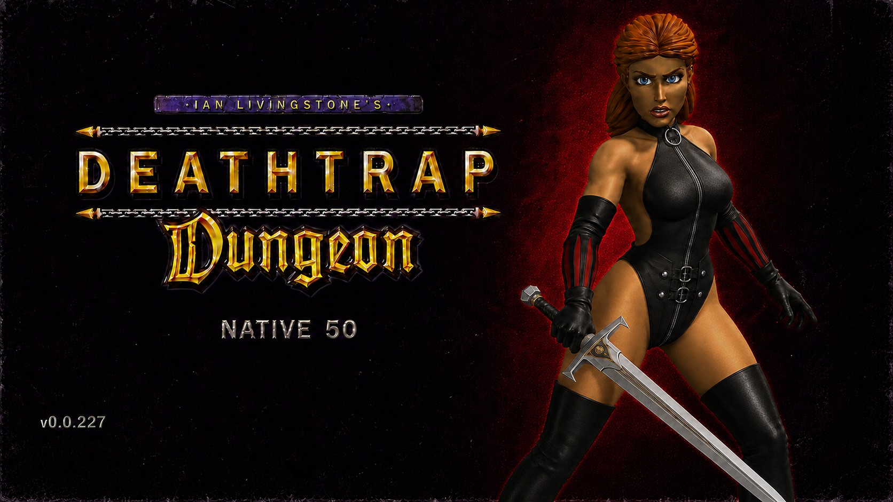

# Deathtrap Native 50

Current development version: **0.0.227**

<p align="center">
  <a href="https://youtu.be/U1RjdVP49TQ"></a>
  <a href="https://ko-fi.com/utkiduck"></a>
</p>

<p align="center">
  
</p>

Deathtrap Native 50 is a free, unofficial modernization patch for the original
32-bit Windows release of *Ian Livingstone's Deathtrap Dungeon* (1998). It
raises the unique rendered output from roughly 16.7 FPS to approximately 50
FPS without speeding up simulation, and adds modern camera, input, controller,
first-person and audio improvements.

The patch was developed using OpenAI Codex under human direction and was
validated through extensive manual playtesting and automated tests.

Verified and tested with the
[Steam release of Deathtrap Dungeon](https://store.steampowered.com/app/245010/Deathtrap_Dungeon/).

The release already includes the Deathtrap-specific widescreen layer, the
dgVoodoo runtime and the tested graphics configuration. There is nothing else
to download or configure before the first launch.

This project is not affiliated with or endorsed by Square Enix, Eidos
Interactive, Asylum Studios, Ian Livingstone or the developers of dgVoodoo.
It contains no game assets, game executables or soundtrack files. The release
redistributes only the required wrapper runtime files under their published
redistribution terms.

## Highlights

- Approximately 50 FPS native presentation while preserving the original game
  speed, AI, combat, collision, animation and audio clocks.
- True Hor+ widescreen gameplay with correctly scaled and positioned 4:3 HUD,
  menus and movies, including the original run/stamina bar.
- DPI-correct borderless presentation by default, plus an INI-selectable
  centered window with an exact client size.
- Freely controlled modern third-person orbit camera for mouse and right stick,
  with collision handling and support for the game's authored camera shots.
- Camera-relative Xbox-compatible controller movement with faster, more
  responsive turning while retaining the original animation and collision.
- Full controller support in gameplay, menus, loading screens and movies,
  including menu navigation and a right-stick pointer.
- Radial inventory selector with the game's own icons for melee, ranged,
  spell/shield and potion/charm categories.
- Quake-style slow motion while keyboard selectors or controller radial wheels
  are open; camera control and selector input remain responsive at full rate,
  including in first person.
- Event-driven controller vibration for attacks, hits, blocking, parries,
  spells, ranged shots, healing, landing, damage, death and radial selection.
- Original Tab/R3 first-person camera plus a separate body-visible immersive
  first-person view on F10/L3.
- Full-speed lateral and diagonal movement in immersive first person on both
  keyboard and controller.
- Physical-mouse camera control, mouse attack/parry and mouse-wheel melee
  weapon selection.
- Correct routing for all fifteen Steam music tracks, with reliable
  pause/resume that preserves the current playback position.
- Safe saving at stable grounded positions through the original menu, slots
  and save-file format; the original authored save points remain available.
- Two-page in-game keyboard rebinding for all twenty gameplay and patch
  actions, with modern defaults and support for the function keys.
- Longer gameplay prompts and safe automatic per-launch support logs.

See the [user-facing changelog](CHANGELOG.md) for the complete consolidated
list of changes from the original Steam release.

## Support the project

Deathtrap Native 50 and all of its downloads and features are completely free.
If you find this already-published patch useful, you may leave an optional tip
through [Ko-fi](https://ko-fi.com/utkiduck).

Tips do not unlock downloads, features, support, rewards, or access to future
work.

[](https://ko-fi.com/utkiduck)

## Compatibility

The current release supports:

- the [Steam release, App ID `245010`](https://store.steampowered.com/app/245010/Deathtrap_Dungeon/);
- Windows 10 or 11 x64;
- the original 32-bit game process;
- the tested game binaries below, or another build with a compatible internal
  layout;
- the tested Deathtrap Dd7to9 native-canvas layer feeding the bundled,
  unmodified dgVoodoo2 2.86.2 x86 D3D9 runtime and D3D11 backend.

| File | Tested Steam SHA-256 |
|---|---|
| `Dungeon.dll` | `95FE9CE0FFF387F00704548F152E4340815213FCB3833DBE1B5C42871E7D2E56` |
| `DD_CD.EXE` | `0C644A00E62652E046C5DAD2960F0F6C8C1998F4CA065780FBD7811D9908BF1F` |

These hashes are compatibility fingerprints, not an installation lock. The
installer warns when either file differs and continues. Other store releases,
fan patches and modified executables have not been verified and may work
partially, fail to activate, crash or corrupt game state. The DLL retains a
structural safety check before applying fixed-address hooks.

[dxwrapper](https://github.com/elishacloud/dxwrapper) supplies the
Deathtrap-specific Dd7to9 layer used by the widescreen renderer. Its local
D3D9 output is handled by the unmodified x86 `D3D9.dll` from
[dgVoodoo2](https://github.com/dege-diosg/dgVoodoo2) 2.86.2. dgVoodoo remains
the final D3D11 backend.

## Download and verification

Published builds are distributed as versioned ZIP files through GitHub
Releases. Each release also includes a SHA-256 file for the complete archive,
and the archive contains `SHA256SUMS.txt` for its individual files.

The ZIP can be extracted directly into the game directory. Runtime files are
kept in `payload` so extracting an update cannot overwrite the installed patch
before `INSTALL.cmd` creates its rollback copy:

```text
INSTALL.cmd
install.ps1
README.txt
CHANGELOG.txt
SHA256SUMS.txt
THIRD_PARTY_NOTICES.txt
LICENSE.txt
payload/
  DINPUT.dll
  deathtrap_native.ini
  keys.cfg
  dxwrapper.ini
  dgVoodoo.conf
  dxwrapper/
    DDraw.dll                Deathtrap native-canvas Dd7to9 stub
    dxwrapper.dll            Deathtrap native-canvas implementation
  dgVoodoo/
    D3DImm.dll               dgVoodoo 2.86.2 x86
    D3D9.dll                 dgVoodoo 2.86.2 x86
optional/
  dgVoodoo-General.png       visual reference for the General tab
  dgVoodoo-DirectX.png       visual reference for the DirectX tab
source/
  dxwrapper/
    README.md                 exact base and reproduction instructions
    deathtrap-dxwrapper.patch Deathtrap-specific source modifications
```

`THIRD_PARTY_NOTICES.txt` is required by the licences of code statically linked
into `DINPUT.dll`; it is part of the minimal distributable package. Copying only
`payload/DINPUT.dll` is not a complete installation because the patch also
requires its configuration and additional native bindings in
`ASYLUM/keys.cfg`.

## Installation

**No separate dgVoodoo download or setup is required.** The release already
contains the tested dgVoodoo 2.86.2 x86 runtime and graphics configuration.

1. Close the game.
2. Extract every file from the Deathtrap Native 50 release ZIP directly beside
   `DD_CD.EXE`, preserving the included `payload` directory.
3. Double-click `INSTALL.cmd` once.
4. Start Deathtrap Dungeon normally through Steam or `DD_CD.EXE`.

That is the complete normal installation. `INSTALL.cmd` checks the game,
backs up any existing patch, dgVoodoo, control and rendering files, and then
installs the complete tested setup.

The installer detects the current primary monitor in physical pixels (not
DPI-scaled logical pixels) and records that size in `deathtrap_native.ini`.
The default `borderless` mode uses a desktop-sized borderless window without
switching the monitor's physical video mode. The native-canvas layer creates
one aspect-correct world target, 1800 pixels high at the default internal scale
of 3, expands only 3D gameplay to the monitor aspect and keeps menus, movies
and the complete HUD in their original proportions.

dgVoodoo stays windowed and leaves resolution `Unforced`, so it does not scale
that canvas a second time. The tested profile enables 8x MSAA, 16x anisotropic
filtering, automatic mipmaps and VSync.

### Display mode and window size

The presentation mode is controlled only by the installed
`deathtrap_native.ini`. For example, on a 2880x1800 primary monitor the
installer writes:

```ini
[Display]
Mode=borderless
WindowWidth=2880
WindowHeight=1800
```

- `Mode=borderless` is the default. It fills the current monitor without an
  exclusive-fullscreen mode switch; `WindowWidth` and `WindowHeight` do not
  limit its size.
- `Mode=windowed` creates a centered framed window whose client area is exactly
  `WindowWidth` by `WindowHeight`. For example, use `1280` by `720` for a
  720p window.

The installer replaces the dimensions from the template with the detected
primary-monitor resolution. They therefore also provide a sensible starting
size if the user later changes `Mode` to `windowed`. Restart the game after
changing any display value.

### Optional: tune advanced dgVoodoo settings

This is not required to run the patch. Display mode and window dimensions must
be changed in `deathtrap_native.ini`, as described above. To inspect or change
advanced wrapper options such as antialiasing or texture filtering:

1. Download the complete package from the
   [official dgVoodoo releases page](https://github.com/dege-diosg/dgVoodoo2/releases).
2. Copy only `dgVoodooCpl.exe` into the Deathtrap Dungeon game directory,
   beside `DD_CD.EXE` and the installed `dgVoodoo.conf`.
3. Run `dgVoodooCpl.exe`, adjust the settings and apply them to the game
   directory.

The patch already installs the required x86 runtime DLLs. Do not replace them
with x64 wrappers. Keep the General tab set to **Windowed**, keep DirectX
resolution **Unforced**, and keep `OutputAPI = d3d11_fl11_0`; other output APIs
are not supported by the native rendering path. Do not use dgVoodoo to select
fullscreen or a resolution multiplier because the Deathtrap layer owns the
final window and native canvas.

**General tab**


**DirectX tab**


`<SteamLibrary>` in examples is a placeholder. The game folder may be anywhere;
no Steam directory layout or manifest is required. The installer:

- checks `DD_CD.EXE`, `Dungeon.dll`, `ASYLUM/keys.cfg` and `ASYLUM/config.dat`
  before making changes, and warns if the game hashes differ from
  the tested build without blocking installation;
- verifies the bundled dgVoodoo runtime hashes and required D3D11 setting;
- backs up the installed patch and wrapper files, including `DINPUT.dll`,
  `DDraw.dll`, `dxwrapper.dll`, `D3D9.dll`, both wrapper configurations and
  the retail control/rendering files;
- installs the tested native-canvas layer and dgVoodoo D3D9/D3D11 backend;
- replaces `ASYLUM/keys.cfg` with the exact keyboard, mouse and joystick
  profile tested with this DLL; the previous file remains in the rollback
  directory;
- normalizes the required game rendering values, including hardware D3D,
  mipmapping and subtractive shadows;
- detects the current primary monitor in physical pixels and records it as the
  default window size;
- replaces `dgVoodoo.conf` with the tested profile after preserving the old
  file in the rollback directory.

Advanced users can run `install.ps1 -WhatIf` to validate the installation
without modifying any game file.
Detailed requirements, first-run verification and rollback instructions are in
[Running and installation](docs/RUNNING.md).

## Controls

### Mouse and keyboard

| Input | Action |
|---|---|
| Mouse movement | Rotate the modern camera; look around in first person |
| Left mouse button | Attack; hold `A` / `D` for left/right attacks or `S` for the turning attack |
| Right mouse button | Block/parry |
| Mouse wheel | Previous/next available melee weapon |
| `W` / `S` | Walk forward/backward |
| `Shift` + `W` / `S` | Run forward/backward |
| `A` / `D` | Turn left/right in normal gameplay |
| `Shift` + `A` / `D` | Fast turn left/right |
| `J` / `K` | Side-step left/right |
| `Ctrl` + `W` / `S` | Step forward/backward |
| `Ctrl` + `A` / `D` | Original side-step left/right |
| `Space` | Jump or climb |
| `Space` + direction | Directional jump |
| `F` | Ranged attack / original combat modifier |
| `F` + `W` / `A` / `D` | Original directional melee attacks |
| `F` + `A` + `D` | Original turning/back attack |
| `F` + `S` | Original parry |
| `Q` | Cast/use the selected spell |
| `E` | Operate or interact |
| `F1` / `F2` / `F3` / `F4` | Melee / ranged / spell-shield / consumable selector |
| `1`-`8` | Choose a slot in an opened retail item selector |
| `Tab` | Toggle the original retail first-person view |
| `F10` | Toggle body-visible immersive first person |
| `F11` | Toggle the higher native render rate |
| `P` | Pause gameplay |
| `Esc` | Open or leave the menu; save and load through the retail menu |

In immersive first person, `A` and `D` become full-speed pure side movement;
`W`/`S` can be combined with them for diagonal movement, and `Shift` selects
the running speed.

Opening any `F1`-`F4` selector slows the game world to 25% speed by default.
The selector, physical mouse, controller and camera continue updating at the
normal presentation rate. This also applies to the body-visible immersive
first-person view. The percentage can be changed under `[Selector]` in
`deathtrap_native.ini`.

The patch enables the retail Save command at safe grounded positions outside
the original save points. Saving and loading still use the original menu,
slot screens and save-file format.

### Xbox-compatible controller

| Input | Gameplay | Menus and selectors |
|---|---|---|
| Left stick | Camera-relative movement; full tilt runs | Navigate |
| Right stick | Rotate the camera / first-person look | Move pointer or select radial slot |
| `A` | Jump or climb | Confirm; skip supported movies/screens |
| `B` | — | Back |
| `X` | Operate/interact | Alternate skip on supported screens |
| `Y` | Unassigned | Unassigned |
| `RT` | Attack; combine with the left stick for directional attacks | — |
| `LT` | Block/parry | — |
| `RB` | Cast/use contextual spell action | — |
| Hold `LB` + left stick | Original side-step movement | — |
| `Start/Menu` | Open pause menu | Back/leave menu |
| `R3` | Toggle original retail first-person view | — |
| `L3` | Toggle body-visible immersive first person | — |
| `View/Back` | Pause/resume gameplay | — |
| Tap D-pad | Cycle the next item in that category | Navigate |
| Hold D-pad | Open radial selector | Keep held and choose with right stick |

D-pad categories are up for melee weapons, right for ranged items, down for
spells/shields, and left for potions/charms. Camera input is suppressed while
the radial selector owns the right stick.

Keyboard bindings can be changed through the game's Keyboard Setup screen.
Use the `<<` and `>>` controls on the right to switch between its two pages;
the existing Keyboard Default control restores the complete modern profile.
All twenty actions are remappable, including `F1`-`F12`. Keyboard rebinding
does not alter the patch-owned controller layout. Controller and camera
sensitivity values remain available in `deathtrap_native.ini`.

## Building

Requirements:

- Visual Studio 2022 C++ Build Tools;
- Windows SDK;
- CMake 3.21 or newer;
- PowerShell 5.1 or newer.

Build and run the complete deterministic verification suite:

```powershell
.\scripts\build-x86.ps1
```

Create the same release package used by GitHub Actions:

```powershell
.\scripts\package-release.ps1 -OutputDirectory artifacts
```

The build must be Win32. A 64-bit DLL cannot be loaded by `DD_CD.EXE`. MinHook
1.3.4 is downloaded during the first CMake configure and linked statically; no
separate MinHook runtime DLL is needed. See [Building](docs/BUILDING.md) and
[third-party notices](THIRD_PARTY_NOTICES.md).

## Release process

`VERSION` is the single source of truth for CMake, DLL metadata, package names
and Git tags. Pushing a matching tag such as `v0.0.226` runs the Windows build,
all deterministic tests, creates a versioned ZIP and checksum, and opens a
draft GitHub Release for final human review.

See [Publishing releases](docs/RELEASING.md) for the exact procedure.

## Projects and repositories used

- [MinHook](https://github.com/TsudaKageyu/minhook) 1.3.4 — the only external
  repository whose code is compiled into `DINPUT.dll`; linked statically under
  its BSD-2-Clause licence.
- [dgVoodoo2](https://github.com/dege-diosg/dgVoodoo2) — x86
  DirectDraw/D3DImm-to-D3D11 runtime. The two required unmodified 2.86.2 DLLs
  are redistributed with this patch under dgVoodoo's published terms.
- [Unity Cinemachine](https://github.com/Unity-Technologies/com.unity.cinemachine)
  — engineering reference for orbit, follow, obstruction and de-occlusion
  camera behavior; no Cinemachine code is included.
- [UE Explorer](https://github.com/UE-Explorer/UE-Explorer) — used while
  researching the state and camera design of *Batman: Arkham Asylum*; no UE
  Explorer code is included.
- [ogg-winmm](https://github.com/bangstk/ogg-winmm) — community reference used
  to investigate the Steam music-routing problem; the project does not ship or
  require this wrapper.

## Acknowledgements

Thanks to the community members who helped test public builds:

- `dbdk422a`
- `517342` — for testing and identifying the directional-control problems
  fixed in version 0.0.221.

## Licence

Deathtrap Native 50 is released under the [MIT License](LICENSE). Third-party
components retain their own licences as documented in
[THIRD_PARTY_NOTICES.md](THIRD_PARTY_NOTICES.md). The MIT licence covers this
project's code and documentation only; it grants no rights to Deathtrap
Dungeon, its assets, names or trademarks.

## Technical documentation

- [Architecture](docs/ARCHITECTURE.md)
- [Camera reverse engineering](docs/CAMERA-REVERSE-ENGINEERING.md)
- [Modern camera design](docs/MODERN-CAMERA-DESIGN.md)
- [Full camera ownership](docs/FULL-CAMERA-OWNERSHIP.md)
- [Camera stability audit](docs/CAMERA-STABILITY-AUDIT-2026-08-01.md)
- [Input roadmap](docs/INPUT-ROADMAP.md)
- [Music fix](docs/MUSIC-FIX.md)

## Support and diagnostics

For installation help and bug reports, join the
[`#help-and-bug-reports` Discord channel](https://discord.gg/9tP8qFG7Y).

Every launch automatically creates one compact timestamped support log under
the game's `logs` directory. No diagnostic option needs to be enabled. The log
records the patch version, Windows display/DPI environment, relevant dgVoodoo
settings, window geometry, DirectInput mouse setup, input ownership changes and
low-rate mouse summaries. It does not contain save data or full local paths.

When reporting a problem, reproduce it once, close the game and attach the
newest `deathtrap-native-*.log` file together with a short description. The log
already contains the minimum environment and version information needed for
initial investigation.

`Diagnostics/DebugLog=0` remains the normal setting. Changing it to `1` adds
the much larger development telemetry to the same per-launch file and should
only be done when specifically requested. Heavy `CameraProbe` and
`HeadJointProbe` streams should remain disabled unless requested.
