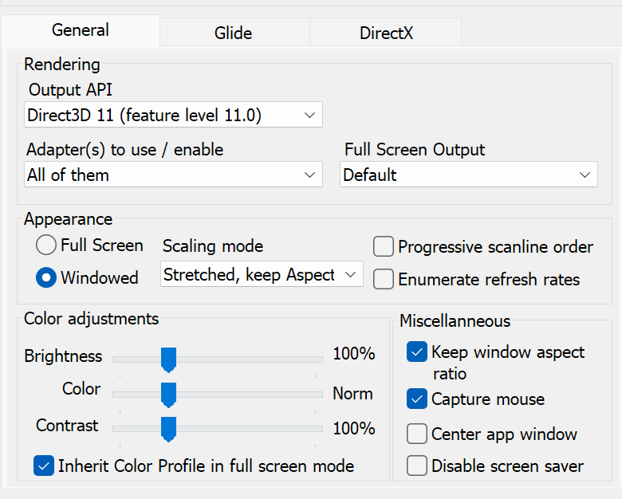
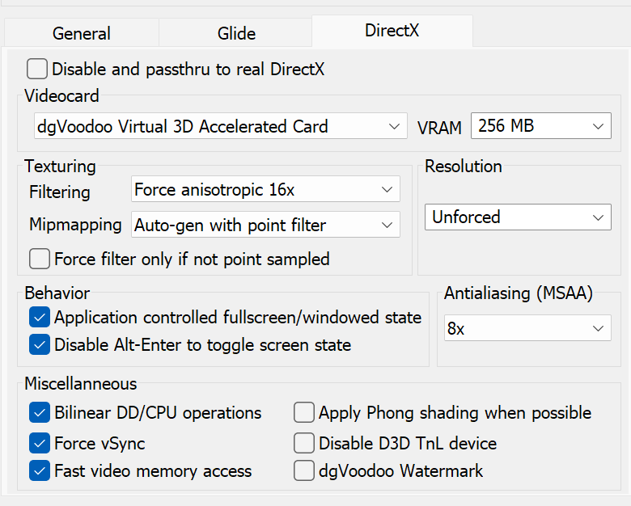

# Installing, display modes and running the patch

## 1. Requirements

- [Steam release of *Deathtrap Dungeon*, App ID `245010`](https://store.steampowered.com/app/245010/Deathtrap_Dungeon/);
- the tested 32-bit game hashes documented in the README, or an untested build
  with a compatible internal layout;
- the bundled dgVoodoo2 2.86.2 **x86** DirectX runtime;
- Windows 10 or 11 and a D3D11-capable GPU driver.

`<GameDirectory>` below means the directory containing `DD_CD.EXE`. The game
may be installed anywhere; no drive letter, Steam-library layout or manifest
path is compiled into the DLL or scripts.

## 2. Final file layout

The final relevant game-directory layout is:

```text
<GameDirectory>\
|-- DD_CD.EXE
|-- Dungeon.dll
|-- DDraw.dll                 tested Deathtrap dxwrapper Dd7to9 stub
|-- dxwrapper.dll             tested Deathtrap native-canvas implementation
|-- dxwrapper.ini             tested native-canvas profile
|-- D3D9.dll                  bundled dgVoodoo 2.86.2 x86
|-- D3DImm.dll                bundled dgVoodoo 2.86.2 x86
|-- dgVoodoo.conf             tested profile installed by this project
|-- DINPUT.dll                this project
|-- deathtrap_native.ini      this project
`-- ASYLUM\
    `-- keys.cfg              tested profile installed by this project
```

Do not copy the x64 dgVoodoo wrappers. `DD_CD.EXE` is a 32-bit process and
cannot load them.

## 3. Display mode and size

The installer queries the current primary display mode in physical pixels and
writes the result to the installed `deathtrap_native.ini`. This avoids Windows
DPI scaling turning a 125% or 150% desktop into smaller logical coordinates.
The runtime itself is Per-Monitor DPI Aware V2. For example, a 2880x1800
primary display produces:

```ini
[Display]
Mode=borderless
WindowWidth=2880
WindowHeight=1800
```

`Mode=borderless` is the tested default. The final window fills the current
monitor without entering exclusive fullscreen or changing the monitor's video
mode. The width and height values do not restrict borderless mode.

`Mode=windowed` creates a centered framed window with an exact client area of
`WindowWidth` by `WindowHeight`. For example:

```ini
[Display]
Mode=windowed
WindowWidth=1280
WindowHeight=720
```

Restart the game after changing these values. Do not combine the two modes by
forcing fullscreen, fake fullscreen or a resolution in dgVoodoo: the
Deathtrap-specific dxwrapper layer is the sole owner of the final game window.

## 4. Bundled dgVoodoo configuration

The public archive contains the exact x86 dgVoodoo 2.86.2 runtime and profile
used during project testing. `INSTALL.cmd` installs both automatically. A
normal user does not need to download or configure dgVoodoo separately.

The fixed output API is:

```text
Direct3D 11 feature level 11.0
```

The installed `dgVoodoo.conf` beside `DD_CD.EXE` contains:

```ini
[General]
OutputAPI = d3d11_fl11_0
```

This setting is required, not optional. The overlay suppresses dgVoodoo's
internal page-restore presentation and validates synthetic surfaces through a
D3D11/DXGI Present hook. These functions are unavailable when dgVoodoo chooses
D3D12, WARP or another backend. Do not use `OutputAPI = bestavailable` for this
build because it may select D3D12.

The installer preserves any previous `dxwrapper.ini`, `dgVoodoo.conf`,
`DDraw.dll`, `dxwrapper.dll`, `D3D9.dll` and `D3DImm.dll` in its timestamped
rollback directory before replacing them.
Advanced users can download the complete dgVoodoo package separately and copy
only `dgVoodooCpl.exe` beside `DD_CD.EXE`. Running it there loads the installed
`dgVoodoo.conf` and allows advanced graphics options such as filtering and
antialiasing to be inspected or changed. Keep the bundled x86 runtime DLLs,
General **Windowed**, DirectX resolution **Unforced**, and
`OutputAPI = d3d11_fl11_0`. Display mode and window size belong in
`deathtrap_native.ini`, not dgVoodoo.

The tested preset uses:

- one aspect-correct render target created by the native-canvas layer;
- `Resolution = unforced`;
- `Antialiasing = 8x`;
- `Filtering = 16` (16x anisotropic);
- `Mipmapping = autogen_point`;
- `ForceVerticalSync = true`;
- `OutputAPI = d3d11_fl11_0`.

Do not add dgVoodoo resolution multipliers to this profile: the preceding
Dd7to9 layer has already created a native-resolution target, so another
multiplier wastes memory and can make the game unplayable.

### General tab



### DirectX tab



## 5. Install the patch

The public release archive has this layout:

```text
INSTALL.cmd
install.ps1
README.txt
SHA256SUMS.txt
THIRD_PARTY_NOTICES.txt
LICENSE.txt
payload/
  DINPUT.dll
  deathtrap_native.ini
  keys.cfg
  dxwrapper.ini
  dgVoodoo.conf
  dxwrapper/
    DDraw.dll
    dxwrapper.dll
  dgVoodoo/
    D3D9.dll
    D3DImm.dll
optional/
  dgVoodoo-General.png
  dgVoodoo-DirectX.png
```

No dgVoodoo preparation is needed. Extract every file directly beside
`DD_CD.EXE`, then double-click `INSTALL.cmd` once. Advanced users may instead
run:

```powershell
powershell.exe -NoProfile -ExecutionPolicy Bypass `
  -File .\install.ps1
```

The script:

1. verifies only the required game files, compares `Dungeon.dll` and
   `DD_CD.EXE` with the tested hashes, and continues with a warning if they
   differ;
2. verifies the bundled dxwrapper and dgVoodoo runtime hashes and D3D11
   configuration;
3. backs up existing patch files, dgVoodoo runtime/configuration,
   `ASYLUM\keys.cfg` and `ASYLUM\config.dat` under
   `back\deathtrap-native50-overlay-<timestamp>`;
4. installs the tested Deathtrap native-canvas layer and dgVoodoo 2.86.2
   D3D9/D3D11 runtime/configuration;
5. replaces `ASYLUM\keys.cfg` with the exact verified keyboard, mouse and
   joystick profile shipped with the same build; the previous file is already
   preserved by step 3;
6. replaces, de-duplicates or adds the required game rendering values without
   changing progress, volume or other unrelated settings;
7. detects the current primary monitor resolution in physical pixels and
   writes it as the installed window-size default;
8. replaces `dgVoodoo.conf` only after backing up the previous file.

Use `-WhatIf` to validate the directory without modifying it.

Copying only `DINPUT.dll` is not a complete installation. A fully manual
installation must copy both runtime files and place the bundled `keys.cfg` at
`ASYLUM\keys.cfg`. This deliberately replaces custom control bindings because
the DLL and action profile are tested as one unit; recover the previous file
from the timestamped rollback directory if needed.

## 6. Launch the game

Any of these launch paths is valid:

- launch the game normally from Steam;
- start `DD_CD.EXE` directly;
- use an external presentation launcher whose target is the original
  `DD_CD.EXE`.

For a direct or external-launcher start, set the working directory to the
directory containing `DD_CD.EXE`. Do not point the launcher at a renamed copy,
the dgVoodoo control panel or another helper executable.

The load chain is automatic:

```text
DD_CD.EXE -> DINPUT.dll -> Windows x86 DirectInput
DD_CD.EXE -> DDraw.dll  -> dxwrapper Dd7to9 -> dgVoodoo D3D9 -> D3D11/DXGI
```

The game imports legacy DirectInput, so Windows loads our `DINPUT.dll`; the DLL
then forwards the original DirectInput exports and activates the native render
patch. No command-line argument is required.

## 7. First-run verification

The normal configuration is:

```ini
[NativeRender]
Enabled=1
Subframes=3

[Display]
Mode=borderless
WindowWidth=<detected physical width>
WindowHeight=<detected physical height>

[Diagnostics]
DebugLog=0
CameraProbe=0
HeadJointProbe=0
NativeCollisionProbe=0
```

`Subframes=3` produces two render-only phases plus the real endpoint, or about
50 presented frames per second from the game's approximately 16.7 Hz source.

`[Text] MessageLifetimePercent=300` keeps ordinary transient messages and PST
level-script notifications three times as long as retail. This scales their
separate 50-tick and 27-tick lifetimes to 150 and 81 ticks. Set it to `100` for
the original durations. It does not affect menus, inventory selectors,
animation, simulation, input or audio timing.

Every launch automatically creates one compact support file in the game's
`logs` directory:

```text
deathtrap-native-YYYYMMDD-HHMMSS-mmm-pidNNNN.log
```

No option needs to be enabled before reproducing a public issue. The compact
records include version, Windows/DPI and display geometry, the relevant
dgVoodoo configuration, DirectInput setup and a low-rate mouse/cursor summary.
A later process launch creates another file instead of appending to the old
one. Ask the user to close the game and attach the newest file.

For a requested deep diagnostic run, set `DebugLog=1`, enter actual gameplay
and then close the game normally. The same session file then also contains the
version banner, periodic `tick=` interpolation telemetry and `native-only
D3D11 swapchain attached`.

`CameraProbe` and `HeadJointProbe` are heavy reverse-engineering streams, not
normal support logging. Version 0.0.198 keeps both at `0`: the accepted camera,
input, collision, transition, error and periodic summary records remain, while
a representative 6.05 MB session loses about 5.21 MB of probe-only data. Set
one probe to `1` only for a specifically requested capture; no DLL rebuild is
required.

`NativeCollisionProbe` is a bounded, visibility-neutral comparison between
the modern camera's render-mesh sweep and Deathtrap's native sector object
lists/collision resources. Leave it disabled for normal play. When requested,
enable it without enabling `DebugLog`; the compact records are written to the
same per-launch file under `logs` and never alter the accepted camera pose.

During gameplay, `F11` toggles only the native render-rate modification. This
provides a direct visual A/B test without restarting the game.

`F10` toggles the overlay-owned immersive first-person view. Gamepad SELECT
performs the same toggle. This is independent of the original Tab/R3
first-person camera: the custom view keeps ordinary walking, running, attacks,
the character body and the equipped weapon visible. Its eye height and forward
offset are configured by `HeadHeight` and `HeadForwardOffset` under `[Camera]`.
The shipped placement is `10` units above and `55` units forward from the
resolved animated head centre. Unlike the controller coordinate pointers, the
accepted anchor stays rigidly attached to the interpolated render root during
forward and reverse movement.

The installer updates `ASYLUM/keys.cfg` before launch. Horizontal mouse motion
uses the game's original normal turn actions. Holding Shift adds the retail
fast-turn actions, so running with Shift+W no longer leaves mouse turning at
the slow walking rate. Left click invokes the normal attack immediately;
holding A or D with it selects the corresponding side attack, while holding S
selects the original turning attack. Right click invokes parry. The DLL never
writes action-table memory and leaves menu pointer/click handling on the
original game path.

The XInput `RT` command enters the same translator. `RT` alone performs the
normal attack; combining it with the left stick selects the matching forward,
side or turning attack. The stick remains on the native joystick movement path
and is not converted into persistent keyboard movement.

The same installer adds native joystick equivalents for running, fast turning
and all four directional jump actions. This is required because camera-relative
movement deliberately uses `JOY_VERT_FORWARDS` rather than synthesizing W; the
game can therefore resolve `A + left stick` as its original running jump.

Mouse-wheel weapon cycling is implemented in 0.0.24. The retail input table
has no wheel source, so the proxy observes relative wheel detents without
altering the state returned to the game. On the next real gameplay tick it
checks the same inventory entries as the retail weapon selector and commits
the next available weapon through the selector's native operation. It never
simulates an F-key and synthetic render phases never consume input.

`WeaponWheel/Enabled=0` disables this feature. `WeaponWheel/Invert=1` reverses
the default direction (wheel up selects the previous available slot; wheel
down selects the next one).

## XInput controller layer

Version 0.0.36 dynamically loads the first available Microsoft XInput runtime
(`xinput1_4`, `xinput1_3`, then `xinput9_1_0`). Gameplay is polled only at a
real game scheduler boundary, while a separate lightweight frontend poll is
available immediately at process startup for movies, loading and menus.
Synthetic native-render phases never poll or repeat controller input.

Version 0.0.39 also loads `XInputSetState` from that runtime. Version 0.0.40
tuned the first action profile for the game's low input-poll frequency.
Version 0.0.46 retains the removal of the raw RT pulse: attack rumble begins
only on the engine-confirmed melee downstroke. Version 0.0.47 gives LT a clear
but still lightweight 60 ms block-action acknowledgement at 100% master
strength. Version 0.0.41 adds
engine-confirmed hit, player-damage and
death envelopes. Version 0.0.42 adds a stronger engine-timed melee downstroke
envelope that also occurs on a miss. Version 0.0.46 queues successful-block
and offensive-spell-launch events until the real XInput owner consumes them, then starts
their full duration at the first submitted motor sample. Configure or disable
them with:

```ini
[XInput]
VibrationEnabled=1
VibrationStrengthPercent=100
MeleeSwingVibrationMs=170
BlockVibrationMs=60
SuccessfulBlockVibrationMs=210
SpellCastVibrationMs=260
RangedShotVibrationMs=115
HealingVibrationMs=320
SelectorTickVibrationMs=38
LandingVibrationMs=145
HeavyDamageVibrationMs=380
HeavyDamageThresholdHp=12
HitVibrationMs=150
DamageVibrationMs=240
DeathVibrationMs=700
```

The motors are forced to zero outside active gameplay, while the radial
selector owns the controls, on focus loss and after controller disconnect.
RT input alone never drives a motor. The melee envelope starts only when the
retail animation enters its accepted damage window. The additional impact
pulse is emitted only when `Dungeon.dll+0x1C130` actually reduces target
health. Player damage and death are identified by comparing that target with
the current player object. With diagnostic logging enabled, the corresponding
records are `game_event confirmed_hit` and `game_event player_damage`.
The melee animation marker appears as `game_event melee_downstroke`, including
the observed animation frame, descriptor window and active weapon ID.
Successful blocks appear as `game_event successful_block` only after the
retail collision code strikes the live player in an already active block state
and selects block-impact animation `0x61`; simply pressing LT is insufficient.
An accepted attack spell appears as `game_event offensive_spell_launch`,
including its selected spell ID and non-null projectile. Healing and utility
actions do not use this event.

Version 0.0.48 adds `game_event ranged_projectile` only after a real player
projectile is created, `game_event healing_consumable` only after player
health rises, `game_event selector_tick` on a changed radial sector,
`game_event landing` after a qualified airborne/contact transition, and
`game_event heavy_player_impact` when confirmed player damage reaches
`HeavyDamageThresholdHp`. The ranged hook can be installed and verified in
the startup log before a ranged weapon has been acquired; no pulse is emitted
until the game later creates an actual projectile.

The default third-person layout interprets the circular left-stick vector in
camera space and turns the character toward it through the game's native
heading gateway. Position, forward motion, animation, wall collision and
walk/run selection remain retail-owned. A is jump/climb, X operate, RT primary
attack, LT parry/block, RB cast spell and Start menu. Hold LB to use the
explicit retail side-step actions; first person uses the same W/S plus
side-step scheme. Version `0.0.114` restores the game's native Tab-driven
first-person view on both physical Tab and R3. R3 toggles the held Tab action;
while native camera mode 4 is active, the right stick drives retail
first-person mouse-look and the modern orbit is suspended. Version `0.0.190`
assigns SELECT to a separate overlay-owned immersive first-person view. It
stays inside the persistent mode-3 rig and uses W/S plus the explicit
side-step path on XInput, so it does not replace or mutate retail Tab/R3.
Version `0.0.191` lowers the eye to the upper-body anchor. Version `0.0.192`
restores the original correct gamepad forward/back polarity and reverses the
engine look-at vector so the visible camera faces the character's course.
Version `0.0.193` replaces the locomotion-dependent controller anchor with the
stable player focus and moves the eye slightly higher/forward.
Start is delivered to the retail menu action as Escape before frontend
ownership changes. The camera watchdog then transfers the controller only
after the game actually leaves its gameplay camera; this prevents Start from
being consumed by the bridge without opening the pause menu.
The right stick and physical mouse rotate that rig on both axes. Version
`0.0.221` keeps the accepted third-person horizontal direction and corrects
only its controller vertical convention. `Camera/InvertX=1` or
`Camera/InvertY=1` reverses the corresponding configured axis.
`Camera/PreferredRadius=1400` sets the unobstructed spring-arm distance. Mouse
X/Y sensitivity uses
`MouseHorizontalMilliDegreesPerPixel` and
`MouseVerticalMilliDegreesPerPixel`.
`RightStickPixelsPerTick=12` and `RightStickResponseCurvePercent=135` provide a
slower precision response near stick center without adding temporal latency.
`ThirdPersonOrbitSpeedPercent=140` makes only the third-person controller
orbit faster; it does not alter mouse sensitivity or the accepted immersive
head view. `RightStickAxisLockPercent=0` keeps the complete circular stick
vector instead of suppressing the secondary component near cardinal axes.

Lever, door and reveal cameras receive temporary priority only after an
explicit X/operate input (including a physical `E`) and independently moving
native camera output while the player is stationary. This is more reliable
than the retail owner flag, which is shared by ordinary fixed-camera zones and
is absent from some reveals. The modern camera resumes its preserved yaw and
pitch when the native shot settles or gameplay resumes. For walls, the original `0x2DEF0`
collision resolver remains authoritative: its resolved distance contracts the
spring arm immediately, while the arm probes outward gradually after the path
clears.

In startup movies, loading screens and menus, right stick moves the existing
game pointer, A clicks/confirms and sends the native movie-skip key, left stick
or D-pad provides arrow-key fallback navigation, B or Start goes back, and X
is an alternate skip key. The controller mouse is merged into both immediate
and buffered DirectInput mouse reads because different retail frontend screens
use different legacy polling modes. Pressing Start explicitly switches the
bridge between gameplay and pause-menu contexts. The layer never draws or
captures a second cursor.
`MenuRightStickPixelsPerTick=6` controls the frontend pointer independently of
first-person look sensitivity.

D-pad maps to the four retail selectors: up close combat, right ranged, down
spells, and left potions/charms. A short tap cycles the next available entry.
Holding a direction for `SelectorHoldMs` opens the game's inventory selector.
Its native slot renderer is repositioned into a large eight-direction ring, so
real inventory icons, numbers, stack quantities and active highlights are
preserved. Move the right stick to choose slot 1–8. The PC ranged row contains
only six inventory weapons; slot 7 remains unused and slot 8 is the retail
F2+8 chalk entry. Controller confirmation calls its dedicated native routine
at `Dungeon.dll+0x458B0` with the current gameplay owner, exactly as the
original ranged selector does. It does not synthesize the separate C binding.
Up/down equip on release; ranged,
chalk and consumable selections require A. `SelectorRadius` and
`SelectorCenterY` adjust the ring in the game's logical coordinate space.

The validated 4:3 center is `SelectorCenterY=316`; the retail UI uses an
upward-growing Y axis with its origin near the bottom edge, not D3D screen
coordinates. `MovementThresholdPercent=14` is applied to the circular left-
stick magnitude. Version 0.0.128 feeds forward magnitude through the game's
native DirectInput joystick poll and `JOY_*` action bindings. With
`CameraRelativeMovement=1`, desired screen-space direction becomes a bounded
heading delta at the shared `+0x82750` ground-state dispatcher. The delta is
published by the engine's own `+0x44DD0` dual writer; native joystick X stays
neutral and native Y remains the forward/root-motion input. Disabling the
option retains unmodified native
joystick tank movement without restoring W/A/S/D. The verified runtime path
requires `CameraRelativeInvertY=1` for physical up to mean away from the
camera; this changes only the longitudinal component and leaves left/right
unchanged. `MovementTurnDegreesPerTick=30` allows a full-speed 180-degree
course correction in roughly six original game ticks (about 0.36 seconds),
reducing the wide running arc without bypassing the native heading writer.
Running engages at `RunThresholdPercent=50` and
disengages only below `RunReleaseThresholdPercent=30`; this hysteresis prevents
noisy diagonal samples from interrupting a run with a one-tick walk transition.

The ranged and consumable categories never activate on release. Keep their
D-pad direction held, choose a slot, and press A to equip or use it; B or
release cancels. This prevents accidental ranged changes, chalk marks or
consumption. Set `XInput/Enabled=0` to disable the whole layer, or
`XInput/BaseBindings=0` to test only the D-pad selector.

With `Diagnostics/DebugLog=1`, render, input and D3D11 present diagnostics all
use that single timestamped per-launch file under `logs`.

For the v0.0.194 head-mount capture, also keep `HeadJointProbe=1`. The probe is
read-only and emits `head_joint_probe`/`head_joint_candidate` records only
while the custom F10/SELECT first-person view is selected. A useful short run
is: stand for two seconds, walk forward, run forward, walk backward, perform
two or three attacks, then stand again. It preserves the v0.0.193 camera pose;
its only purpose is to identify the animated head/neck node before changing
camera ownership.

Version 0.0.195 consumes that result. `HeadHeight=10` is the small upward
offset from the animated head centre and `HeadForwardOffset=55` advances the
near plane in front of the face along the current view heading. These are no
longer offsets from the player root or `camera_focus`. Keep `HeadJointProbe=1`
for the first acceptance run; it remains read-only and confirms the resolved
branch while the camera log records the selected node and head centre.

In v0.0.196 the head resolver accepts the neck translation produced by
sideways/backward locomotion; it must no longer switch to third person during
those animations. Version 0.0.221 later separates only the controller pitch
sign at the two camera-mode boundaries: the already accepted custom head view
is unchanged, while modern third person uses its corrected trailing-orbit
vertical convention. Physical mouse signs remain on their independently
verified path.

Version 0.0.206 gives the F10/SELECT head view a complete movement vector.
Keyboard W/S+A/D combinations and diagonals work simultaneously; pure A/D
uses ordinary walking root motion redirected at the three verified player-only
root-transform callsites while the matching actor/collision course is active
for the same transaction. Shift selects the matching native running pace. The
complete left-stick vector uses the same `RunThresholdPercent` and release
hysteresis as forward movement. There are no separate HeadStrafe percentage
settings. Third person, retail Tab/R3 and explicit J/K/LB side-step keep their
existing behavior.

Version 0.0.197 keeps the custom head view active through the complete
`HeadMinimumPitchDegrees=-75` to `HeadMaximumPitchDegrees=75` range. Looking
past +/-60 degrees must no longer expose third person. The eye's 55-unit
forward placement remains horizontal; only the user-owned view direction
pitches up/down.

The v0.0.197 camera result remains the stable immersive first-person baseline
in v0.0.198. No additional diagnostic sequence is pending, so both heavy
probes are disabled in the installed production preset.

The layout follows two established conventions: the right stick acts as a
pointer in menus and as camera look in gameplay, while hold, select and release
matches the standard radial-menu interaction.

## Close-camera transparency run (0.0.222)

The rejected final-position lowering experiment is disabled. Version 0.0.222
keeps one exact requested yaw/pitch ray. The analytic player capsule does not
participate in collision or choose another shot. It only makes the player
subtree half-transparent while the accepted modern third-person camera volume
intersects the character; three clear source ticks prevent flicker on exit.
`camera_character_fade` and bounded `camera_character_probe` records identify
the presentation transition.

For one short run, back into a flat wall and rotate the camera through a full
circle. Then stand in a two-wall corner and rotate for several seconds. If the
camera contracts through the character, verify that the character becomes
transparent and returns to opaque after leaving the corner. Toggle the custom
F10/SELECT head view while close to a wall and confirm that body, arms and
weapon remain fully visible. The resulting per-process file in `logs` is
sufficient; no debug option or deep camera probe needs to be enabled.

## 8. Common failures

- **No change after pressing F11:** compare the `Dungeon.dll` hash with the
  tested value and confirm that `DINPUT.dll` is beside the original
  `DD_CD.EXE`. Unknown builds are allowed by the installer but may fail the
  DLL's structural compatibility check.
- **Black flashes or stale pages:** verify `OutputAPI = d3d11_fl11_0`; D3D12 and
  `bestavailable` are not supported by this build.
- **The game does not start:** verify that all injected and dgVoodoo DLLs are
  x86, then restore the installer's timestamped backup.
- **The installer rejects the directory:** select the directory that directly
  contains `DD_CD.EXE`, `Dungeon.dll`, `ASYLUM\keys.cfg` and
  `ASYLUM\config.dat`. It does not need to be inside a Steam library.
- **Borderless is the wrong size or Windows DPI scaling changes the geometry:**
  reinstall the current build so the physical primary-monitor dimensions are
  written again, then confirm `Mode=borderless`. The support log records both
  physical display and DPI geometry.
- **The desktop changes resolution or a second scaler appears:** restore the
  bundled wrapper profiles. dgVoodoo must remain Windowed with DirectX
  resolution Unforced, and `FullscreenWindowMode` must remain disabled in
  `dxwrapper.ini`.
